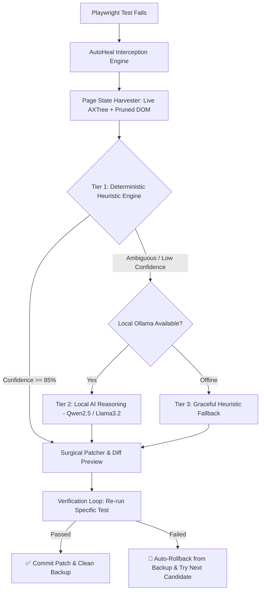

<div align="center">

# 🔮 AutoHeal-QA

### 100% Free, Open-Source Self-Healing E2E Test Runner for Playwright
**Stop manually fixing broken locators after every UI redesign. Heal your Playwright test suites locally with $0 cloud cost.**

[](https://github.com/RitualDev-Lab/autoheal-qa/actions)
[](https://github.com/RitualDev-Lab/autoheal-qa)
[](https://playwright.dev)
[](https://ollama.ai)
[](https://www.typescriptlang.org)
[](LICENSE)
[](https://github.com/RitualDev-Lab/autoheal-qa/pulls)
[](https://ritualdev-lab.github.io/DevShelf/)

<p align="center">
  <a href="#-quick-start"><b>⚡ Quick Start</b></a> •
  <a href="#-comparison-autoheal-qa-vs-commercial-tools"><b>⚖️ Why AutoHeal-QA</b></a> •
  <a href="#-architecture--how-it-works"><b>🏗️ Architecture</b></a> •
  <a href="#-usage-guide"><b>📖 Usage Guide</b></a> •
  <a href="https://ritualdev-lab.github.io/DevShelf/"><b>📚 DevShelf Ecosystem</b></a>
</p>

---

</div>

## ⚡ Why AutoHeal-QA?

Flaky tests and UI redesigns waste **hundreds of engineering hours** every month. Existing self-healing tools either:
- Require expensive cloud subscriptions ($1,000s/mo per seat).
- Leak proprietary DOM snapshots and credentials to 3rd-party LLM APIs.
- Blindly patch source code without verifying if the fix actually passes.

**AutoHeal-QA** solves this once and for all:
- **100% Free & Local**: Deterministic algorithms first ($0, <1ms), with local **Ollama** models (`qwen2.5-coder`, `llama3.2`) for complex UI rewrites. Zero cloud API tokens required.
- **Surgical Auto-Patcher**: Intelligently updates your actual `.spec.ts` files while preserving indentation, chaining (`.click()`, `.fill()`), and formatting.
- **Verification Loop**: Automatically re-runs the failed test before committing. If the patch fails, it auto-rolls back from backup and tries alternative candidates.
- **Safe by Default**: Automatically creates `.autoheal-backup` snapshots before modifying disk. Revert anytime with `autoheal rollback`.

---

## 📊 Comparison: AutoHeal-QA vs Commercial Tools

| Feature | AutoHeal-QA | Commercial Cloud QA (Mabl, Testim) | Legacy Plugins (Healenium) |
| :--- | :---: | :---: | :---: |
| **Pricing** | **100% Free & Open Source ($0)** | \$1,200 – \$5,000 / month | Free, but requires Docker/DB setup |
| **Privacy / Data Security** | **100% In-Process & Local** | Code & DOM sent to cloud | Local backend required |
| **AI Architecture** | **Multi-Tiered (Heuristics + Local Ollama)** | Proprietary Cloud Models | Classical ML (Selenium only) |
| **Playwright Native** | :white_check_mark: Native | :warning: Wrapper / Vendor Lock-in | :x: Selenium-centric |
| **Surgical Code Patching** | :white_check_mark: Modifies source files | :x: No (cloud dashboard only) | :x: No (database locator store) |
| **Verification Loop** | :white_check_mark: Auto-verifies before commit | :x: Manual review | :x: No auto-verification |
| **Instant Rollback** | :white_check_mark: `autoheal rollback` | :x: No | :x: No |

---

## 🏗️ Architecture & How It Works



---

## 🚀 Quickstart in 30 Seconds

### 1. Install AutoHeal-QA
```bash
pnpm add -D autoheal
# or
npm install --save-dev autoheal
```

### 2. Configure Playwright Reporter
Add `@autoheal/interceptor` to your `playwright.config.ts`:
```ts
import { defineConfig } from "@playwright/test";

export default defineConfig({
  reporter: [
    ["list"],
    ["@autoheal/interceptor", { outputFile: "autoheal-failures.json" }],
  ],
});
```

### 3. Run Your Tests with AutoHeal
```bash
autoheal test
```

If any locators break, AutoHeal intercepts the failure and captures the live accessibility snapshot.

### 4. Interactively Review & Apply Patches
```bash
autoheal heal
```

You will see an instant colorized diff preview:
```diff
[#1/1] Authentication Suite > user logs in successfully
Broken: page.getByRole('button', { name: 'Submit' })
File:   tests/auth.spec.ts:14

🔍 Analyzing candidates and finding optimal replacement...
✨ Suggested: page.getByRole('button', { name: 'Sign In to Account' }) (95% confidence) [⚡ Local Heuristics ($0)]
   Reason:    Matching button with 92% text similarity to name "Sign In to Account"

📋 Proposed Diff Preview:
--- a/tests/auth.spec.ts:14
+++ b/tests/auth.spec.ts:14
@@ -14,1 +14,1 @@
-   await page.getByRole('button', { name: 'Submit' }).click();
+   await page.getByRole('button', { name: 'Sign In to Account' }).click();

👉 Apply this patch? [Y]es / [n]o / [a]ll / [q]uit: y
⏳ Verifying patch with Playwright runner...
✅ Verification PASSED: Tests pass with new locator! Committed to auth.spec.ts.
```

---

## 💻 CLI Command Reference

| Command | Description |
| :--- | :--- |
| `autoheal test [args...]` | Runs Playwright tests with AutoHeal failure interception active. |
| `autoheal test --heal` | Runs Playwright and automatically triggers interactive healing if any tests fail. |
| `autoheal heal` | Interactively reviews failed tests and applies verified patches. |
| `autoheal heal --yes` | Automatically verifies and applies all patches without interactive prompts (ideal for CI/CD). |
| `autoheal heal --no-verify` | Applies patches immediately without re-running test verification. |
| `autoheal report` | Generates a visual standalone HTML dashboard (`autoheal-report.html`). |
| `autoheal rollback` | Reverts all `.autoheal-backup` files across the workspace. |

---

## 🎨 Standalone Visual HTML Report

Whenever tests fail, AutoHeal automatically compiles an interactive, dark-mode visual report:

```bash
autoheal report
```
Open `autoheal-report.html` in your browser to view:
- **Overview Metrics**: Total failures, captured DOM snapshots, running cost ($0.00).
- **Comparison Cards**: Side-by-side broken locator vs suggested replacement.
- **Confidence Meters**: Transparent score breakdowns (role matching, string distance, action compatibility).
- **Interactive AXTree Inspector**: Expandable candidate elements captured at the exact moment of failure.

---

## 🧪 Try the Demo Sandbox

Clone this repository and run the included interactive demo:
```bash
git clone https://github.com/RitualDev-Lab/autoheal-qa.git
cd autoheal-qa
pnpm install
pnpm build

# Run the demo
cd examples/demo-app
pnpm run test:heal
```

---

## 💖 Support & GitHub Sponsors

AutoHeal-QA is built as a **100% free, community-first open-source alternative** to closed-source enterprise test automation tools. We believe world-class QA engineering should be accessible to every solo developer and startup without massive monthly bills.

If AutoHeal-QA saves your team hours of flaky test debugging, please consider supporting ongoing development:

- ⭐ **Star this repository** on GitHub.
- 💬 **Share AutoHeal-QA** on Twitter/X, LinkedIn, and Reddit.
- ☕ **Sponsor on GitHub Sponsors**: Help us keep AutoHeal-QA 100% free and independent.

---

## 📄 License

Distributed under the **MIT License**. See [LICENSE](LICENSE) for details.
